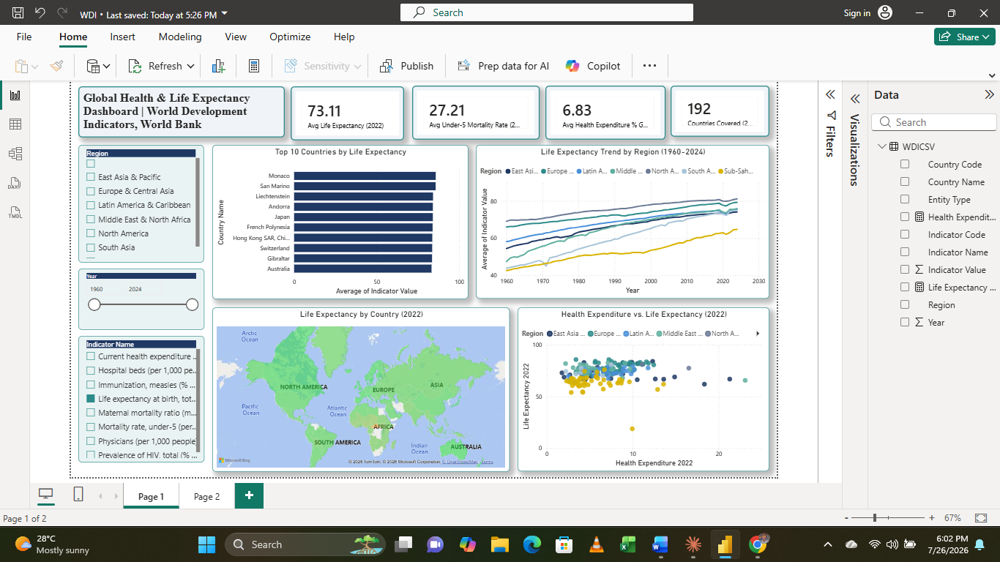

# Global Health & Life Expectancy Dashboard

**AnalystLab Africa — Data Analytics Internship (Batch B) | Capstone Project**

An end-to-end data analytics project analyzing global health and life expectancy outcomes using the World Bank's World Development Indicators (WDI) dataset, covering 1960–2024 across 190+ countries.

---

## 🎯 Project Objective

To identify patterns in global health outcomes and healthcare investment across countries and regions, and translate those patterns into insights and recommendations that could support health policy and resource allocation decisions.

**Core question:** How do life expectancy and other key health outcomes vary across countries and regions, and to what extent does healthcare spending explain that variation?

## 📊 Dataset

- **Source:** [World Bank World Development Indicators (WDI)](https://datatopics.worldbank.org/world-development-indicators/)
- **Scope:** 8 health indicators × 190+ countries × 1960–2024
- **Indicators used:**
  - Life expectancy at birth, total (years)
  - Mortality rate, under-5 (per 1,000 live births)
  - Maternal mortality ratio (per 100,000 live births)
  - Current health expenditure (% of GDP)
  - Physicians (per 1,000 people)
  - Hospital beds (per 1,000 people)
  - Prevalence of HIV, total (% of population ages 15–49)
  - Immunization, measles (% of children ages 12–23 months)
    
> **Note:** The full dataset is not included in this repository due to file size 
> constraints (the cleaned working file exceeds GitHub's practical size limits). 
> The dataset can be downloaded directly from the source above, and the complete 
> data cleaning process (Power Query steps) is documented in this README and in 
> the full report.

## 🧹 Data Cleaning Process

1. Filtered the raw WDI bulk export (~397,000 rows) down to the 8 selected indicators.
2. Unpivoted year columns (1960–2025) from wide format into a long format for proper time-series analysis.
3. Removed null values, resulting in a clean dataset of **73,246 rows**.
4. Merged in country metadata (Region, Income Group) to distinguish real countries from regional/income aggregates (e.g. "World", "Sub-Saharan Africa").
5. Flagged a **data quality anomaly**: the Central African Republic's 2022 life expectancy was recorded as 18.8 years in the WDI export — inconsistent with historical trend and external sources (~54.5 years). Retained and documented for transparency rather than silently corrected. See full report for details.

Full methodology and findings are documented in [`report/Health_Life_Expectancy_Capstone_Report.docx`](.https://drive.google.com/file/d/1UsYUzyxwD2Lza_U4XnsqyHeiT65Prgwy/view?usp=sharing).

## 📈 Dashboard

Built in Power BI, the dashboard includes:

- **KPI Cards** — Average Life Expectancy, Under-5 Mortality Rate, Health Expenditure (% GDP), Countries Covered (all anchored to 2022)
- **Trend Analysis** — Regional life expectancy trends, 1960–2024
- **Top 10 Countries** bar chart by life expectancy
- **World map** — life expectancy by country (2022), shaded orange-to-green
- **Scatter plot** — health expenditure vs. life expectancy, colored by region
- **Slicers** — filter by Region, Year, and Indicator



## 🔍 Key Insights

- Global average life expectancy in 2022 was **73.11 years**, but this masks sharp regional disparities — Sub-Saharan Africa trails other regions by 15–20+ years.
- Health expenditure and life expectancy show a positive but **plateauing** relationship — gains taper off past ~6–10% of GDP.
- The highest life-expectancy countries (Monaco, San Marino, Japan, Switzerland, etc.) are predominantly small, wealthy, or highly developed economies, not necessarily the biggest health spenders.
- A genuine data quality issue was identified and validated in the source dataset itself (see Data Cleaning Process above).

## 💡 Recommendations

1. Policymakers in lower-life-expectancy regions should prioritize healthcare system efficiency and access, not just raw spending increases.
2. Global health organizations should target interventions at Sub-Saharan Africa specifically, where the outcome gap has persisted for six decades.
3. Analysts working with global datasets should always cross-validate outliers against historical trends and secondary sources before drawing conclusions.

## 🛠️ Tools Used

- **Power BI** — data modeling, DAX measures, dashboard design
- **Power Query (M)** — data cleaning and transformation
- **Excel** — intermediate data staging
- **Word** — final report

## 📁 Repository Structure

```
health-life-expectancy-dashboard/
├── README.md
├── power-bi/
│   └── WDI_Health_Dashboard.pbix
├── report/
│   └── Health_Life_Expectancy_Capstone_Report.docx
├── screenshots/
│   ├── dashboard_overview.png
│   ├── map_view.png
│   └── scatter_view.png
└── video/
    └── demo_video_link.md
```

## 🎥 Demo Video

[.https://drive.google.com/file/d/1EHWT6oFEDAQOZHVzIZ4zlcZEq6lRFlmI/view?usp=drive_link] — walkthrough of objective, dataset, cleaning process, analysis, dashboard, insights, and recommendations.

## 👤 Author

**Gloria Okoli**
Data Analytics Intern, AnalystLab Africa
[LinkedIn](http://linkedin.com/in/okoli-gloria) · [GitHub](https://github.com/Gloria-Okoli)

---

*Submitted as part of the AnalystLab Africa Data Analytics Internship, Batch B (June–August 2026).*

